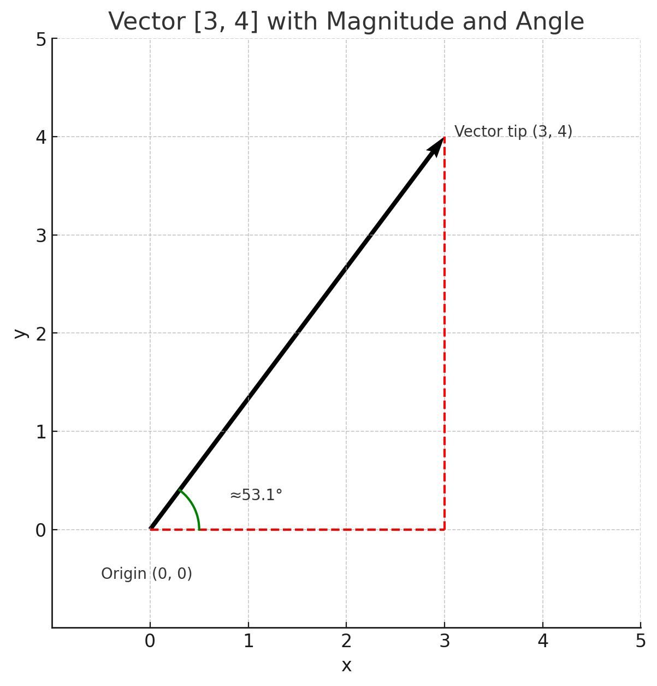

# 📐 Linear Algebra Introduction

<div style="background: linear-gradient(135deg, #667eea 0%, #764ba2 100%); padding: 20px; border-radius: 10px; color: white; margin-bottom: 20px;">
<h2 style="color: white; margin-top: 0;">📘 Overview</h2>
<p style="font-size: 1.1em; margin-bottom: 0;">This comprehensive guide provides conceptual foundations and instructional strategies for linear algebra in machine learning. It complements hands-on practice with deep mathematical insights and practical applications.</p>
</div>

> 💻 **<span style="color: #2196F3;">Hands-On Practice</span>**: This theory guide pairs with [01_linear_algebra_intro.ipynb](01_linear_algebra_intro.ipynb) for interactive coding exercises and visualizations.

---

## 🧠 <span style="color: #4CAF50;">Key Concepts</span>

### 🎯 <span style="color: #FF9800;">What Are Vectors and Why Do They Matter?</span>

<div style="background-color: #E3F2FD; border-left: 4px solid #2196F3; padding: 15px; margin: 15px 0; border-radius: 5px;">
<strong style="color: #1976D2;">Definition:</strong> <strong>Vectors</strong> are the fundamental building blocks of machine learning. At their core, vectors are ordered lists of numbers that represent quantities with both <strong>magnitude</strong> (size) and <strong>direction</strong>. But this simple definition barely scratches the surface of why they're so crucial.
</div>

#### 🔍 <span style="color: #9C27B0;">The Deep Importance of Vectors in Machine Learning</span>

<div style="background-color: #F3E5F5; border-radius: 8px; padding: 20px; margin: 15px 0;">

**<span style="color: #7B1FA2;">1. 📊 Data Representation</span>**
<div style="background-color: #FFFFFF; padding: 10px; border-radius: 5px; margin: 10px 0;">
Every piece of data in machine learning is ultimately represented as a vector:
<ul style="color: #424242;">
<li>🖼️ An image is a vector of pixel intensities</li>
<li>📄 A text document becomes a vector of word frequencies or embeddings</li>
<li>👤 A customer profile is a vector of features (age, income, purchase history)</li>
<li>🎵 A song is a vector of audio frequencies over time</li>
</ul>
</div>

**<span style="color: #7B1FA2;">2. 🌐 Feature Spaces</span>**
<div style="background-color: #FFFFFF; padding: 10px; border-radius: 5px; margin: 10px 0;">
Vectors allow us to place data points in multi-dimensional spaces where:
<ul style="color: #424242;">
<li>🎯 Similar data points cluster together</li>
<li>👁️ Patterns become geometrically visible</li>
<li>📏 Distances between points represent similarity</li>
<li>🤖 Machine learning algorithms can find decision boundaries</li>
</ul>
</div>

**<span style="color: #7B1FA2;">3. ⚙️ Mathematical Operations</span>**
<div style="background-color: #FFFFFF; padding: 10px; border-radius: 5px; margin: 10px 0;">
All core ML operations are vector operations:
<ul style="color: #424242;">
<li><strong style="color: #4CAF50;">Similarity</strong>: Dot products measure how alike two data points are</li>
<li><strong style="color: #4CAF50;">Transformations</strong>: Matrices transform data from one representation to another</li>
<li><strong style="color: #4CAF50;">Learning</strong>: Neural networks are chains of vector transformations</li>
<li><strong style="color: #4CAF50;">Optimization</strong>: Gradient descent moves through vector spaces to find optimal solutions</li>
</ul>
</div>

</div>

#### 👁️ <span style="color: #FF5722;">Visual Understanding: Vectors as Arrows in Space</span>

<div style="background-color: #FFF3E0; border-left: 4px solid #FF9800; padding: 15px; margin: 15px 0; border-radius: 5px;">
<strong style="color: #F57C00;">Visualization:</strong> Think of a vector as an arrow that:
<ul style="color: #424242; margin-top: 10px;">
<li>🎯 <strong>Starts at the origin</strong> (0,0) in 2D or (0,0,0) in 3D</li>
<li>📍 <strong>Points to a specific location</strong> defined by its coordinates</li>
<li>📏 <strong>Has length</strong> (magnitude) = √(x² + y²) in 2D</li>
<li>🧭 <strong>Has direction</strong> determined by the angle it makes with the axes</li>
</ul>
</div>

#### ❓ <span style="color: #795548;">Why Do Vectors Start at the Origin?</span>

<div style="background-color: #EFEBE9; border-radius: 8px; padding: 15px; margin: 15px 0;">
<strong style="color: #5D4037;">In our examples, vectors start at the origin (0,0) for practical reasons:</strong>

<div style="background-color: #FFFFFF; padding: 10px; border-radius: 5px; margin: 10px 0;">
<ul style="color: #424242;">
<li>📐 <strong style="color: #795548;">Standard reference point</strong>: Creates consistency for all vector operations</li>
<li>🎓 <strong style="color: #795548;">Teaching clarity</strong>: Makes the relationship between coordinates and position obvious</li>
<li>🧮 <strong style="color: #795548;">Simplified calculations</strong>: Coordinates directly give vector components</li>
</ul>
</div>
</div>

#### 🤔 <span style="color: #607D8B;">Is the Origin Always (0,0)?</span>

<div style="background-color: #ECEFF1; border-radius: 8px; padding: 15px; margin: 15px 0;">
<div style="background-color: #FFFFFF; padding: 15px; border-radius: 5px; border-left: 4px solid #607D8B;">
<strong style="color: #37474F;">No!</strong> Vectors can start from any point in space. The vector [3, 4] represents the same displacement whether it goes from (0,0) to (3,4) or from (5,7) to (8,11).
</div>

<strong style="color: #455A64; margin-top: 15px; display: block;">🌍 Real-world examples where vectors don't start at origin:</strong>
<div style="background-color: #FFFFFF; padding: 10px; border-radius: 5px; margin: 10px 0;">
<ul style="color: #424242;">
<li>🚗 <strong style="color: #607D8B;">Physics</strong>: Car velocity vectors start from the car's current location</li>
<li>🎮 <strong style="color: #607D8B;">Computer graphics</strong>: Object movement vectors start from current position</li>
<li>🤖 <strong style="color: #607D8B;">Machine learning</strong>: Feature vectors may use different baseline points</li>
</ul>
</div>

<div style="background-color: #E8F5E8; border-left: 4px solid #4CAF50; padding: 15px; margin: 15px 0; border-radius: 5px;">
<strong style="color: #2E7D32;">💡 Key Insight:</strong> The power of vectors lies in their ability to represent <strong>direction and magnitude</strong> independent of their starting position. Whether a vector starts at (0,0), (5,3), or any other point, it carries the same essential information about displacement and direction.
</div>
</div>

#### ⚖️ <span style="color: #E91E63;">Vector Comparison: Same vs Different Starting Points</span>

<div style="background-color: #FCE4EC; border-radius: 10px; padding: 20px; margin: 20px 0;">
<div style="background-color: #FFFFFF; padding: 15px; border-radius: 5px; border-left: 4px solid #E91E63; margin-bottom: 15px;">
<strong style="color: #AD1457;">❓ Are vectors always compared to the same starting point?</strong> <strong style="color: #C2185B;">No!</strong> The comparison approach depends on what you're trying to measure.
</div>

<div style="display: grid; grid-template-columns: 1fr 1fr; gap: 15px; margin-top: 20px;">

<div style="background-color: #E8F5E8; border-radius: 8px; padding: 15px;">
<h5 style="color: #2E7D32; margin-top: 0;">🟢 SAME Starting Point</h5>
<div style="background-color: #FFFFFF; padding: 10px; border-radius: 5px;">
<strong style="color: #388E3C;">Purpose:</strong> Compare directions and magnitudes directly
<br><br>
<strong style="color: #388E3C;">Use cases:</strong>
<ul style="color: #424242; margin: 10px 0;">
<li>🤖 <strong>ML similarity</strong>: User preference vectors from "neutral"</li>
<li>⚡ <strong>Physics</strong>: Force vectors from same object</li>
<li>📊 <strong>Data analysis</strong>: Feature vectors from common baseline</li>
</ul>
</div>
</div>

<div style="background-color: #FFF3E0; border-radius: 8px; padding: 15px;">
<h5 style="color: #F57C00; margin-top: 0;">🟠 DIFFERENT Starting Points</h5>
<div style="background-color: #FFFFFF; padding: 10px; border-radius: 5px;">
<strong style="color: #FF8F00;">Purpose:</strong> Compare relative movements or changes
<br><br>
<strong style="color: #FF8F00;">Use cases:</strong>
<ul style="color: #424242; margin: 10px 0;">
<li>🗺️ <strong>Navigation</strong>: GPS from different locations</li>
<li>📈 <strong>Stock analysis</strong>: Price changes from different dates</li>
<li>🎮 <strong>Game dev</strong>: Character movements from current positions</li>
</ul>
</div>
</div>

</div>
</div>

#### 🌟 <span style="color: #673AB7;">Real-World Examples</span>

<div style="background-color: #F3E5F5; border-radius: 10px; padding: 20px; margin: 20px 0;">

<div style="background-color: #E8F5E8; border-radius: 8px; padding: 15px; margin: 15px 0;">
<h5 style="color: #2E7D32;">🎯 Same Starting Point - Recommendation Systems</h5>
<div style="background-color: #FFFFFF; padding: 12px; border-radius: 5px; font-family: monospace;">
<span style="color: #1976D2;">User A likes:</span> [Comedy: <span style="color: #4CAF50;">5</span>, Action: <span style="color: #FF9800;">2</span>, Drama: <span style="color: #F44336;">1</span>]<br>
<span style="color: #1976D2;">User B likes:</span> [Comedy: <span style="color: #4CAF50;">4</span>, Action: <span style="color: #FF9800;">1</span>, Drama: <span style="color: #F44336;">3</span>]<br>
<span style="color: #666;">Both vectors start from [0,0,0] to compare preferences directly</span>
</div>
</div>

<div style="background-color: #FFF3E0; border-radius: 8px; padding: 15px; margin: 15px 0;">
<h5 style="color: #F57C00;">🗺️ Different Starting Points - Navigation</h5>
<div style="background-color: #FFFFFF; padding: 12px; border-radius: 5px; font-family: monospace;">
<span style="color: #1976D2;">Person A</span> at (10,20) → store: vector [<span style="color: #4CAF50;">5,3</span>]<br>
<span style="color: #1976D2;">Person B</span> at (50,60) → same store: vector [<span style="color: #F44336;">-35,-37</span>]<br>
<span style="color: #666;">Same destination, different starting points, different vectors</span>
</div>
</div>

<div style="background-color: #E3F2FD; border-radius: 8px; padding: 15px; margin: 15px 0;">
<h5 style="color: #1976D2;">💹 Same Starting Point - Stock Performance</h5>
<div style="background-color: #FFFFFF; padding: 12px; border-radius: 5px; font-family: monospace;">
<span style="color: #1976D2;">Stock A:</span> [Week1: <span style="color: #4CAF50;">+2%</span>, Week2: <span style="color: #F44336;">-1%</span>, Week3: <span style="color: #4CAF50;">+3%</span>]<br>
<span style="color: #1976D2;">Stock B:</span> [Week1: <span style="color: #4CAF50;">+1%</span>, Week2: <span style="color: #4CAF50;">+2%</span>, Week3: <span style="color: #F44336;">-1%</span>]<br>
<span style="color: #666;">Both start from 0% baseline to compare performance patterns</span>
</div>
</div>

<div style="background-color: #F3E5F5; border-radius: 8px; padding: 15px; margin: 15px 0;">
<h5 style="color: #7B1FA2;">🎮 Different Starting Points - Game Physics</h5>
<div style="background-color: #FFFFFF; padding: 12px; border-radius: 5px; font-family: monospace;">
<span style="color: #1976D2;">Player 1</span> at (100,200) moves right: vector [<span style="color: #4CAF50;">10,0</span>]<br>
<span style="color: #1976D2;">Player 2</span> at (300,400) moves right: vector [<span style="color: #4CAF50;">10,0</span>]<br>
<span style="color: #666;">Same movement, different locations, identical displacement vectors</span>
</div>
</div>

</div>

```
Vector [3, 4]:
y ↑
4 | .  .  .  ●  .  .      ← vector tip at (3, 4)
3 | .  .  .  │  .  .
2 | .  .  .  │  .  .
1 | .  .  .  │  .  .
0 | ●────────┘  .  .      ← vector base at (0, 0)
    0  1  2  3  4  5 → x

Length = √(3² + 4²) = √25 = 5  
Direction = arctan(4/3) ≈ 53.1°
```

#### 📐 <span style="color: #3F51B5;">Angles Between Vectors: The Heart of Similarity</span>

<div style="background-color: #E8EAF6; border-radius: 10px; padding: 20px; margin: 20px 0;">
<div style="background-color: #FFFFFF; padding: 15px; border-radius: 5px; border-left: 4px solid #3F51B5; margin-bottom: 15px;">
<strong style="color: #303F9F;">The angle between two vectors tells us everything about their relationship:</strong>
</div>

<div style="display: grid; grid-template-columns: 1fr 1fr 1fr; gap: 15px; margin: 20px 0;">

<div style="background-color: #E8F5E8; border-radius: 8px; padding: 15px; text-align: center;">
<h5 style="color: #2E7D32; margin-top: 0;">🎯 θ = 0°</h5>
<div style="background-color: #FFFFFF; padding: 10px; border-radius: 5px;">
<strong style="color: #4CAF50;">Same Direction</strong><br>
<span style="color: #666;">Vectors perfectly aligned</span>
<ul style="color: #424242; text-align: left; margin: 10px 0;">
<li>✅ Dot product is <strong style="color: #4CAF50;">maximum positive</strong></li>
<li>🤖 ML: Data points are <strong style="color: #4CAF50;">very similar</strong></li>
</ul>
</div>
</div>

<div style="background-color: #FFF3E0; border-radius: 8px; padding: 15px; text-align: center;">
<h5 style="color: #F57C00; margin-top: 0;">⊥ θ = 90°</h5>
<div style="background-color: #FFFFFF; padding: 10px; border-radius: 5px;">
<strong style="color: #FF9800;">Perpendicular</strong><br>
<span style="color: #666;">Vectors are orthogonal</span>
<ul style="color: #424242; text-align: left; margin: 10px 0;">
<li>⚪ Dot product is <strong style="color: #FF9800;">zero</strong></li>
<li>🤖 ML: Data points are <strong style="color: #FF9800;">unrelated</strong></li>
</ul>
</div>
</div>

<div style="background-color: #FFEBEE; border-radius: 8px; padding: 15px; text-align: center;">
<h5 style="color: #D32F2F; margin-top: 0;">↔️ θ = 180°</h5>
<div style="background-color: #FFFFFF; padding: 10px; border-radius: 5px;">
<strong style="color: #F44336;">Opposite Direction</strong><br>
<span style="color: #666;">Vectors anti-aligned</span>
<ul style="color: #424242; text-align: left; margin: 10px 0;">
<li>❌ Dot product is <strong style="color: #F44336;">maximum negative</strong></li>
<li>🤖 ML: Data points are <strong style="color: #F44336;">opposites</strong></li>
</ul>
</div>
</div>

</div>

<div style="background-color: #E1F5FE; border-left: 4px solid #0288D1; padding: 15px; margin: 15px 0; border-radius: 5px;">
<strong style="color: #0277BD;">🚀 Why This Matters in Machine Learning:</strong>
<ul style="color: #424242; margin-top: 10px;">
<li>🎯 <strong style="color: #0288D1;">Recommendation systems</strong>: Find users with similar preferences (small angles)</li>
<li>📄 <strong style="color: #0288D1;">Text analysis</strong>: Measure document similarity using word vectors</li>
<li>🖼️ <strong style="color: #0288D1;">Image recognition</strong>: Compare feature vectors to classify objects</li>
<li>🧠 <strong style="color: #0288D1;">Neural networks</strong>: Attention mechanisms use vector similarities</li>
</ul>
</div>
</div>

---

### 🔑 <span style="color: #795548;">Core Mathematical Concepts</span>

<div style="background-color: #EFEBE9; border-radius: 10px; padding: 20px; margin: 20px 0;">

<div style="display: grid; grid-template-columns: 1fr 1fr; gap: 15px;">

<div style="background-color: #E3F2FD; border-radius: 8px; padding: 15px;">
<h5 style="color: #1976D2; margin-top: 0;">📊 Vectors</h5>
<div style="background-color: #FFFFFF; padding: 10px; border-radius: 5px;">
Multi-dimensional arrows representing data points, features, or transformations
</div>
</div>

<div style="background-color: #F3E5F5; border-radius: 8px; padding: 15px;">
<h5 style="color: #7B1FA2; margin-top: 0;">🔲 Matrices</h5>
<div style="background-color: #FFFFFF; padding: 10px; border-radius: 5px;">
Grids of numbers that can transform space. Imagine them as functions that stretch, rotate, reflect, or squash vectors.
</div>
</div>

<div style="background-color: #E8F5E8; border-radius: 8px; padding: 15px;">
<h5 style="color: #2E7D32; margin-top: 0;">⚫ Dot Product</h5>
<div style="background-color: #FFFFFF; padding: 10px; border-radius: 5px;">
Measures alignment between two vectors. It is maximum when vectors point in the same direction.
</div>
</div>

<div style="background-color: #FFF3E0; border-radius: 8px; padding: 15px;">
<h5 style="color: #F57C00; margin-top: 0;">✖️ Matrix Multiplication</h5>
<div style="background-color: #FFFFFF; padding: 10px; border-radius: 5px;">
Combines transformations. Order matters (<span style="color: #F44336; font-family: monospace;">AB ≠ BA</span>).
</div>
</div>

</div>
</div>

---

## 🔍 <span style="color: #6A1B9A;">Mathematical Derivations</span>

<div style="background: linear-gradient(135deg, #8E24AA 0%, #5E35B1 100%); padding: 20px; border-radius: 10px; color: white; margin-bottom: 20px;">
<h3 style="color: white; margin-top: 0;">🧮 Core Mathematical Foundations</h3>
<p style="font-size: 1.1em; margin-bottom: 0;">Deep dive into the mathematical principles that power machine learning algorithms</p>
</div>

### ⚫ <span style="color: #4CAF50;">Dot Product</span>

<div style="background-color: #E8F5E8; border-radius: 10px; padding: 20px; margin: 20px 0;">

<div style="background-color: #FFFFFF; border-left: 4px solid #4CAF50; padding: 20px; border-radius: 5px; margin-bottom: 20px;">
<h4 style="color: #2E7D32; margin-top: 0;">📐 Formula</h4>
<div style="text-align: center; font-size: 1.3em; margin: 20px 0; padding: 15px; background-color: #F1F8E9; border-radius: 8px;">
$$\mathbf{a} \cdot \mathbf{b} = \|a\| \|b\| \cos(\theta)$$
</div>
</div>

<div style="background-color: #FFFFFF; border-radius: 8px; padding: 20px;">
<h4 style="color: #388E3C; margin-top: 0;">🔍 Breaking Down This Notation:</h4>

<div style="display: grid; grid-template-columns: 1fr 1fr; gap: 15px; margin-top: 15px;">

<div style="background-color: #E3F2FD; border-radius: 8px; padding: 15px;">
<h5 style="color: #1976D2; margin-top: 0;">📊 $\mathbf{a} \cdot \mathbf{b}$</h5>
<ul style="color: #424242; margin: 0;">
<li>The dot product of vectors <strong>a</strong> and <strong>b</strong></li>
<li>Read as "<strong style="color: #1976D2;">a dot b</strong>"</li>
<li>The $\cdot$ symbol represents the dot product operation</li>
<li><strong>Bold letters</strong> indicate vectors (not scalars)</li>
</ul>
</div>

<div style="background-color: #F3E5F5; border-radius: 8px; padding: 15px;">
<h5 style="color: #7B1FA2; margin-top: 0;">📏 $\|a\|$, $\|b\|$</h5>
<ul style="color: #424242; margin: 0;">
<li>The magnitude (length) of vectors</li>
<li>Double pipes $\| \|$ mean "<strong style="color: #7B1FA2;">length of</strong>"</li>
<li>Also written as $|\mathbf{a}|$ or **length**$(\mathbf{a})$</li>
<li>Always positive values</li>
</ul>
</div>

<div style="background-color: #FFF3E0; border-radius: 8px; padding: 15px;">
<h5 style="color: #F57C00; margin-top: 0;">📐 $\cos(\theta)$</h5>
<ul style="color: #424242; margin: 0;">
<li>Cosine of the angle between vectors</li>
<li>$\cos$ is the cosine trigonometric function</li>
<li>$\theta$ (theta) = angle between <strong>a</strong> and <strong>b</strong></li>
<li>Range: -1 to +1</li>
</ul>
</div>

<div style="background-color: #FFEBEE; border-radius: 8px; padding: 15px;">
<h5 style="color: #D32F2F; margin-top: 0;">🎯 Geometric Meaning</h5>
<ul style="color: #424242; margin: 0;">
<li>Measures <strong style="color: #D32F2F;">alignment</strong> between vectors</li>
<li>Equals projection of one vector onto another</li>
<li>Maximum when vectors point same direction</li>
<li>Zero when vectors are perpendicular</li>
</ul>
</div>

</div>
</div>
</div>

### 🎯 <span style="color: #FF5722;">Vector Projection: The Heart of Geometric Understanding</span>

<div style="background-color: #FFF3E0; border-radius: 10px; padding: 20px; margin: 20px 0;">

<div style="background-color: #FFFFFF; border-left: 4px solid #FF5722; padding: 20px; border-radius: 5px; margin-bottom: 20px;">
<strong style="color: #D84315; font-size: 1.1em;">Vector projection</strong> is one of the most important concepts in linear algebra and machine learning. It answers the question: <strong style="color: #FF5722;">"How much of vector <strong>a</strong> lies in the direction of vector <strong>b</strong>?"</strong>
</div>

#### 🔍 <span style="color: #E65100;">What is Vector Projection?</span>

<div style="background-color: #FFFFFF; border-radius: 8px; padding: 20px; margin: 15px 0;">
<div style="background-color: #FFF8E1; border-left: 4px solid #FFC107; padding: 15px; border-radius: 5px; margin-bottom: 15px;">
<strong style="color: #F57C00;">💡 Intuition:</strong> The <strong>projection</strong> of vector <strong>a</strong> onto vector <strong>b</strong> is the "shadow" that <strong>a</strong> casts onto <strong>b</strong> when light shines perpendicular to <strong>b</strong>.
</div>

<h5 style="color: #D84315; margin-top: 20px;">📐 Vector Projection Formula:</h5>
<div style="text-align: center; font-size: 1.2em; margin: 20px 0; padding: 15px; background-color: #FFEBEE; border-radius: 8px;">
$$\mathrm{proj}_{\mathbf{b}} \mathbf{a} = \frac{\mathbf{a} \cdot \mathbf{b}}{\|\mathbf{b}\|^2} \mathbf{b}$$
</div>

<div style="display: grid; grid-template-columns: 1fr 1fr; gap: 15px; margin-top: 20px;">

<div style="background-color: #E3F2FD; border-radius: 8px; padding: 15px;">
<h6 style="color: #1976D2; margin-top: 0;">📊 $\mathrm{proj}_{\mathbf{b}} \mathbf{a}$</h6>
<ul style="color: #424242; margin: 0; font-size: 0.9em;">
<li>Read as "projection of <strong>a</strong> onto <strong>b</strong>"</li>
<li>$\mathrm{proj}$ = projection operation</li>
<li>Subscript $\mathbf{b}$ = target direction</li>
<li>$\mathbf{a}$ = source vector</li>
</ul>
</div>

<div style="background-color: #F3E5F5; border-radius: 8px; padding: 15px;">
<h6 style="color: #7B1FA2; margin-top: 0;">⚫ $\mathbf{a} \cdot \mathbf{b}$</h6>
<ul style="color: #424242; margin: 0; font-size: 0.9em;">
<li>Dot product of vectors</li>
<li>Measures alignment</li>
<li>Key component of projection</li>
<li>Can be positive, negative, or zero</li>
</ul>
</div>

<div style="background-color: #E8F5E8; border-radius: 8px; padding: 15px;">
<h6 style="color: #2E7D32; margin-top: 0;">📏 $\|\mathbf{b}\|^2$</h6>
<ul style="color: #424242; margin: 0; font-size: 0.9em;">
<li>Squared magnitude of <strong>b</strong></li>
<li>Normalizes the projection</li>
<li>Always positive</li>
<li>Ensures correct scaling</li>
</ul>
</div>

<div style="background-color: #FFF3E0; border-radius: 8px; padding: 15px;">
<h6 style="color: #F57C00; margin-top: 0;">🎯 $\mathbf{b}$</h6>
<ul style="color: #424242; margin: 0; font-size: 0.9em;">
<li>Direction vector</li>
<li>Defines projection direction</li>
<li>Result is parallel to this</li>
<li>Bold = vector notation</li>
</ul>
</div>

</div>
</div>

<h5 style="color: #D84315; margin-top: 25px;">📏 Scalar Projection Formula:</h5>
<div style="text-align: center; font-size: 1.2em; margin: 20px 0; padding: 15px; background-color: #E8F5E8; border-radius: 8px;">
$$\mathrm{comp}_{\mathbf{b}} \mathbf{a} = \frac{\mathbf{a} \cdot \mathbf{b}}{\|\mathbf{b}\|} = \|\mathbf{a}\| \cos(\theta)$$
</div>

<div style="background-color: #FFFFFF; border-radius: 8px; padding: 15px; margin: 15px 0;">
<div style="display: grid; grid-template-columns: 1fr 1fr 1fr; gap: 10px;">

<div style="background-color: #E1F5FE; border-radius: 6px; padding: 12px;">
<h6 style="color: #0277BD; margin-top: 0; font-size: 0.9em;">📐 $\mathrm{comp}_{\mathbf{b}} \mathbf{a}$</h6>
<p style="color: #424242; margin: 0; font-size: 0.8em;">Component of <strong>a</strong> in direction <strong>b</strong> (just the length)</p>
</div>

<div style="background-color: #F3E5F5; border-radius: 6px; padding: 12px;">
<h6 style="color: #7B1FA2; margin-top: 0; font-size: 0.9em;">📏 $\|\mathbf{a}\|$</h6>
<p style="color: #424242; margin: 0; font-size: 0.8em;">Magnitude of vector <strong>a</strong></p>
</div>

<div style="background-color: #FFF3E0; border-radius: 6px; padding: 12px;">
<h6 style="color: #F57C00; margin-top: 0; font-size: 0.9em;">📐 $\cos(\theta)$</h6>
<p style="color: #424242; margin: 0; font-size: 0.8em;">Cosine of angle between vectors</p>
</div>

</div>
</div>

</div>

#### 🚀 <span style="color: #1976D2;">Why Projection Matters in Machine Learning</span>

<div style="background-color: #E3F2FD; border-radius: 10px; padding: 20px; margin: 20px 0;">
<div style="display: grid; grid-template-columns: 1fr 1fr; gap: 15px;">

<div style="background-color: #FFFFFF; border-radius: 8px; padding: 15px;">
<h5 style="color: #1976D2; margin-top: 0;">🔬 Feature Extraction</h5>
<p style="color: #424242; margin: 0;">Project high-dimensional data onto lower dimensions (PCA)</p>
</div>

<div style="background-color: #FFFFFF; border-radius: 8px; padding: 15px;">
<h5 style="color: #1976D2; margin-top: 0;">📏 Similarity Measurement</h5>
<p style="color: #424242; margin: 0;">How much two data points align in a specific direction</p>
</div>

<div style="background-color: #FFFFFF; border-radius: 8px; padding: 15px;">
<h5 style="color: #1976D2; margin-top: 0;">📈 Regression</h5>
<p style="color: #424242; margin: 0;">Find the best-fit line by projecting data points</p>
</div>

<div style="background-color: #FFFFFF; border-radius: 8px; padding: 15px;">
<h5 style="color: #1976D2; margin-top: 0;">🧠 Neural Networks</h5>
<p style="color: #424242; margin: 0;">Attention mechanisms compute projections to focus on relevant information</p>
</div>

</div>
</div>

### 📏 <span style="color: #8BC34A;">Understanding Vector Magnitude and Direction: Breaking Down the Example</span>

<div style="background-color: #F1F8E9; border-radius: 10px; padding: 20px; margin: 20px 0;">

<div style="background-color: #FFFFFF; border-left: 4px solid #8BC34A; padding: 20px; border-radius: 5px; margin-bottom: 20px;">
<strong style="color: #689F38; font-size: 1.1em;">Let's thoroughly understand this fundamental example:</strong>
</div>

<div style="background-color: #FFFFFF; border-radius: 8px; padding: 20px; margin: 15px 0; font-family: monospace; text-align: center; border: 2px solid #8BC34A;">
<div style="font-size: 1.2em; color: #2E7D32; margin-bottom: 10px;"><strong>Vector [3, 4]:</strong></div>
<div style="color: #1976D2;">Length = √(3² + 4²) = √25 = <strong style="color: #FF5722; font-size: 1.3em;">5</strong></div>
<div style="color: #7B1FA2;">Direction = arctan(4/3) ≈ <strong style="color: #FF9800; font-size: 1.3em;">53.1°</strong></div>
</div>

#### 🔢 <span style="color: #FF5722;">What Does the "5" Represent?</span>

<div style="background-color: #FFFFFF; border-radius: 8px; padding: 20px; margin: 15px 0;">
<div style="background-color: #FFEBEE; border-left: 4px solid #FF5722; padding: 15px; border-radius: 5px; margin-bottom: 15px;">
<strong style="color: #D32F2F;">The "5" is the magnitude (or length) of the vector [3, 4].</strong>
</div>

<h5 style="color: #D84315; margin-top: 20px;">📐 Step-by-Step Calculation:</h5>
<div style="background-color: #FFF3E0; border-radius: 8px; padding: 15px; margin: 15px 0;">
<ol style="color: #424242; margin: 0;">
<li><strong style="color: #FF5722;">Start with Pythagorean theorem</strong>: For 2D vector [x, y], length = √(x² + y²)</li>
<li><strong style="color: #FF5722;">Substitute values</strong>: √(3² + 4²)</li>
<li><strong style="color: #FF5722;">Calculate squares</strong>: √(9 + 16)</li>
<li><strong style="color: #FF5722;">Add them</strong>: √25</li>
<li><strong style="color: #FF5722;">Take square root</strong>: 5</li>
</ol>
</div>

<div style="display: grid; grid-template-columns: 1fr 1fr; gap: 15px; margin-top: 20px;">

<div style="background-color: #E3F2FD; border-radius: 8px; padding: 15px;">
<h6 style="color: #1976D2; margin-top: 0;">🎯 Physical Interpretation</h6>
<p style="color: #424242; margin: 0; font-size: 0.9em;">If you drew this vector as an arrow from (0,0) to (3,4), the arrow would be exactly 5 units long. This is the straight-line distance from origin to point (3,4).</p>
</div>

<div style="background-color: #F3E5F5; border-radius: 8px; padding: 15px;">
<h6 style="color: #7B1FA2; margin-top: 0;">🤖 Why This Matters in ML</h6>
<ul style="color: #424242; margin: 0; font-size: 0.9em;">
<li>🖼️ <strong>Image processing</strong>: Brighter pixels</li>
<li>🎯 <strong>Recommendations</strong>: Stronger preferences</li>
<li>📄 <strong>Text analysis</strong>: More important words</li>
</ul>
</div>

</div>
</div>

#### 📐 <span style="color: #FF9800;">What is "arctan" and What Does 53.1° Mean?</span>

<div style="background-color: #FFFFFF; border-radius: 8px; padding: 20px; margin: 15px 0;">
<div style="background-color: #FFF8E1; border-left: 4px solid #FF9800; padding: 15px; border-radius: 5px; margin-bottom: 15px;">
<strong style="color: #F57C00;">arctan</strong> (also written as tan⁻¹) is the <strong>inverse tangent function</strong>. It answers: <strong style="color: #FF9800;">"What angle has this tangent value?"</strong>
</div>

<h5 style="color: #F57C00; margin-top: 20px;">🔍 The Breakdown:</h5>
<div style="background-color: #FFF3E0; border-radius: 8px; padding: 15px; margin: 15px 0;">
<ol style="color: #424242; margin: 0;">
<li><strong style="color: #FF9800;">Tangent of angle</strong>: tan(θ) = opposite/adjacent</li>
<li><strong style="color: #FF9800;">For vector [3, 4]</strong>: tan(θ) = 4/3 ≈ 1.333</li>
<li><strong style="color: #FF9800;">Arctan reverses this</strong>: arctan(4/3) = θ ≈ 53.1°</li>
</ol>
</div>

<div style="background-color: #E8F5E8; border-left: 4px solid #4CAF50; padding: 15px; border-radius: 5px; margin: 15px 0;">
<strong style="color: #2E7D32;">🎯 What 53.1° represents:</strong> This is the angle our vector makes with the positive x-axis. Standing at origin and looking along positive x-axis, you'd rotate counterclockwise by 53.1° to point at the vector tip.
</div>

<div style="text-align: center; margin: 20px 0;">

</div>

<h6 style="color: #1976D2; margin-top: 20px;">🚀 Why Direction Matters in ML:</h6>
<div style="background-color: #E3F2FD; border-radius: 8px; padding: 15px; margin: 15px 0;">
<ul style="color: #424242; margin: 0;">
<li>🎯 <strong style="color: #1976D2;">Similarity</strong>: Vectors in similar directions = similar data</li>
<li>🔍 <strong style="color: #1976D2;">Classification</strong>: Decision boundaries depend on feature vector directions</li>
<li>📊 <strong style="color: #1976D2;">Clustering</strong>: Similar directions often = same cluster</li>
<li>📉 <strong style="color: #1976D2;">Dimensionality reduction</strong>: Preserve important directions</li>
</ul>
</div>
</div>

#### 🎯 <span style="color: #9C27B0;">The Complete Picture: Magnitude + Direction = Vector</span>

<div style="background-color: #F3E5F5; border-radius: 10px; padding: 20px; margin: 20px 0;">
<div style="background-color: #FFFFFF; border-left: 4px solid #9C27B0; padding: 15px; border-radius: 5px;">
<strong style="color: #7B1FA2;">A vector is completely defined by its magnitude and direction:</strong>
</div>

<div style="display: grid; grid-template-columns: 1fr 1fr; gap: 20px; margin-top: 20px;">

<div style="background-color: #FFFFFF; border-radius: 8px; padding: 20px; text-align: center;">
<h5 style="color: #FF5722; margin-top: 0;">📏 Magnitude (5)</h5>
<p style="color: #424242; margin: 0;"><strong>How strong/intense</strong> the data point is</p>
</div>

<div style="background-color: #FFFFFF; border-radius: 8px; padding: 20px; text-align: center;">
<h5 style="color: #FF9800; margin-top: 0;">🧭 Direction (53.1°)</h5>
<p style="color: #424242; margin: 0;"><strong>What type/category</strong> the data point represents</p>
</div>

</div>

<div style="background-color: #E8F5E8; border-left: 4px solid #4CAF50; padding: 15px; margin: 15px 0; border-radius: 5px;">
<strong style="color: #2E7D32;">💡 Key Insight:</strong> This is why vectors are so powerful in ML—they encode both the <strong>"how much"</strong> and the <strong>"what kind"</strong> of information in a single mathematical object.
</div>
</div>

</div>

### ✖️ <span style="color: #673AB7;">Matrix Multiplication</span>

<div style="background-color: #F3E5F5; border-radius: 10px; padding: 20px; margin: 20px 0;">

<div style="background-color: #FFFFFF; border-left: 4px solid #673AB7; padding: 20px; border-radius: 5px; margin-bottom: 20px;">
<strong style="color: #512DA8; font-size: 1.1em;">Matrix multiplication combines transformations and is fundamental to machine learning operations.</strong>
</div>

<h4 style="color: #7B1FA2; margin-top: 0;">📐 Formula</h4>
<div style="background-color: #FFFFFF; border-radius: 8px; padding: 20px; margin: 15px 0;">
<div style="text-align: center; margin-bottom: 15px;">
<strong style="color: #673AB7;">If $A$ is an $m \times n$ matrix and $B$ is an $n \times p$ matrix, then:</strong>
</div>
<div style="text-align: center; font-size: 1.3em; margin: 20px 0; padding: 15px; background-color: #EDE7F6; border-radius: 8px;">
$$C = AB$$ 
**is an** $m \times p$ **matrix**
</div>
</div>

<h4 style="color: #7B1FA2; margin-top: 20px;">🔍 Breaking Down This Notation:</h4>

<div style="display: grid; grid-template-columns: 1fr 1fr; gap: 15px; margin-top: 15px;">

<div style="background-color: #E3F2FD; border-radius: 8px; padding: 15px;">
<h5 style="color: #1976D2; margin-top: 0;">🔲 $A$, $B$, $C$</h5>
<ul style="color: #424242; margin: 0; font-size: 0.9em;">
<li>Capital letters represent matrices</li>
<li>Rectangular arrays of numbers</li>
<li>$C$ is the result of $A \times B$</li>
</ul>
</div>

<div style="background-color: #E8F5E8; border-radius: 8px; padding: 15px;">
<h5 style="color: #2E7D32; margin-top: 0;">📏 $m \times n$</h5>
<ul style="color: #424242; margin: 0; font-size: 0.9em;">
<li>Read as "m by n"</li>
<li>$m$ = rows in matrix $A$</li>
<li>$n$ = columns in matrix $A$</li>
<li>$\times$ symbol means "by"</li>
</ul>
</div>

<div style="background-color: #FFF3E0; border-radius: 8px; padding: 15px;">
<h5 style="color: #F57C00; margin-top: 0;">📐 $n \times p$</h5>
<ul style="color: #424242; margin: 0; font-size: 0.9em;">
<li>Dimensions of matrix $B$</li>
<li>$n$ rows, $p$ columns</li>
<li>Note: $n$ must match!</li>
</ul>
</div>

<div style="background-color: #FFEBEE; border-radius: 8px; padding: 15px;">
<h5 style="color: #D32F2F; margin-top: 0;">⚠️ $AB$ (Order Matters!)</h5>
<ul style="color: #424242; margin: 0; font-size: 0.9em;">
<li>Matrix multiplication of $A$ and $B$</li>
<li>Columns in $A$ = Rows in $B$</li>
<li><strong style="color: #D32F2F;">$AB \neq BA$</strong></li>
</ul>
</div>

</div>

<div style="background-color: #FFFFFF; border-radius: 8px; padding: 15px; margin: 15px 0;">
<h5 style="color: #673AB7; margin-top: 0;">🎯 Result Dimensions: $m \times p$</h5>
<div style="background-color: #F3E5F5; border-radius: 5px; padding: 10px;">
<p style="color: #424242; margin: 0; text-align: center;">
<strong>Result has:</strong> Same rows as $A$ <span style="color: #673AB7;">×</span> Same columns as $B$
</p>
</div>
</div>

</div>

---

## 🎨 <span style="color: #E91E63;">Analogies & Intuition</span>

<div style="background-color: #FCE4EC; border-radius: 10px; padding: 20px; margin: 20px 0;">

<div style="background-color: #FFFFFF; border-left: 4px solid #E91E63; padding: 15px; border-radius: 5px; margin-bottom: 20px;">
<strong style="color: #C2185B; font-size: 1.1em;">🧠 Think of these concepts in everyday terms to build intuition</strong>
</div>

<div style="display: grid; grid-template-columns: 1fr 1fr; gap: 20px;">

<div style="background-color: #FFFFFF; border-radius: 8px; padding: 20px;">
<h4 style="color: #4CAF50; margin-top: 0;">⚫ Dot Product</h4>
<div style="background-color: #E8F5E8; border-radius: 5px; padding: 15px;">
<p style="color: #424242; margin: 0;">Like comparing how much two people are walking in the same direction. If they're walking together, the dot product is large. If one goes left and one goes right, it's zero.</p>
</div>
</div>

<div style="background-color: #FFFFFF; border-radius: 8px; padding: 20px;">
<h4 style="color: #FF9800; margin-top: 0;">🔄 Matrix as Transformation</h4>
<div style="background-color: #FFF3E0; border-radius: 5px; padding: 15px;">
<p style="color: #424242; margin: 0;">Picture gridlines bending, stretching, or rotating after a matrix is applied. The matrix is like a lens that warps space.</p>
</div>
</div>

<div style="background-color: #FFFFFF; border-radius: 8px; padding: 20px;">
<h4 style="color: #2196F3; margin-top: 0;">🆔 Identity Matrix</h4>
<div style="background-color: #E3F2FD; border-radius: 5px; padding: 15px;">
<p style="color: #424242; margin: 0;">Like multiplying by 1; it does nothing. It's the "do nothing" transformation that leaves everything unchanged.</p>
</div>
</div>

<div style="background-color: #FFFFFF; border-radius: 8px; padding: 20px;">
<h4 style="color: #9E9E9E; margin-top: 0;">⚫ Zero Matrix</h4>
<div style="background-color: #F5F5F5; border-radius: 5px; padding: 15px;">
<p style="color: #424242; margin: 0;">Like muting all output. Everything becomes zero - it's the "black hole" of transformations.</p>
</div>
</div>

</div>
</div>

---

## 🎯 <span style="color: #FF5722;">Tutor Instructions</span>

### Teaching Prompts
- Ask the student: “If the dot product is zero, what can we say about the angle between the vectors?”
- Have the student sketch a 2D vector and visualize what happens when you apply a matrix that doubles x-values and halves y-values.
- Encourage drawing: “Show me what a rotation matrix does to this square.”

### Pop Quiz Strategy
- Interleave memory questions from later topics (e.g., “Can you see how the dot product comes back in neural networks?”).
- Use “what-if” questions: “What if the transformation matrix is all zeros?”

---

## 🧪 <span style="color: #9C27B0;">Quiz Questions (with Answers)</span>

<div style="background-color: #F3E5F5; border-radius: 10px; padding: 20px; margin: 20px 0;">

<div style="background-color: #FFFFFF; border-radius: 8px; padding: 15px; margin: 15px 0;">
<strong style="color: #7B1FA2;">Q1.</strong> What does the dot product measure?
<div style="background-color: #E8F5E8; border-left: 4px solid #4CAF50; padding: 10px; margin: 10px 0; border-radius: 5px;">
<strong style="color: #2E7D32;">✅ Answer:</strong> Alignment / cosine similarity between vectors
</div>
</div>

<div style="background-color: #FFFFFF; border-radius: 8px; padding: 15px; margin: 15px 0;">
<strong style="color: #7B1FA2;">Q2.</strong> What is the result of dotting a vector with itself?
<div style="background-color: #E8F5E8; border-left: 4px solid #4CAF50; padding: 10px; margin: 10px 0; border-radius: 5px;">
<strong style="color: #2E7D32;">✅ Answer:</strong> The squared magnitude of the vector
</div>
</div>

<div style="background-color: #FFFFFF; border-radius: 8px; padding: 15px; margin: 15px 0;">
<strong style="color: #7B1FA2;">Q3.</strong> What kind of transformation does this matrix perform?

<div style="text-align: center; font-size: 1.2em; margin: 15px 0; padding: 15px; background-color: #F3E5F5; border-radius: 8px;">
$$\begin{bmatrix} 2 & 0 \\ 0 & 1 \end{bmatrix}$$
</div>

<div style="background-color: #FFF8E1; border-radius: 5px; padding: 10px; margin: 10px 0;">
<strong style="color: #F57C00;">📐 Matrix notation explanation:</strong>
<ul style="color: #424242; margin: 5px 0; font-size: 0.9em;">
<li><strong>$\begin{bmatrix} \end{bmatrix}$</strong>: Square brackets indicate a matrix</li>
<li><strong>Rows and columns</strong>: Numbers arranged horizontally and vertically</li>
<li><strong>$2 \times 2$ matrix</strong>: 2 rows and 2 columns</li>
<li><strong>Matrix elements</strong>: Each number has a position (row, column)</li>
</ul>
</div>

<div style="background-color: #E8F5E8; border-left: 4px solid #4CAF50; padding: 10px; margin: 10px 0; border-radius: 5px;">
<strong style="color: #2E7D32;">✅ Answer:</strong> Horizontal stretching (x-dimension doubled)
</div>
</div>

<div style="background-color: #FFFFFF; border-radius: 8px; padding: 15px; margin: 15px 0;">
<strong style="color: #7B1FA2;">Q4.</strong> Can matrix multiplication be commutative?
<div style="background-color: #FFEBEE; border-left: 4px solid #F44336; padding: 10px; margin: 10px 0; border-radius: 5px;">
<strong style="color: #D32F2F;">❌ Answer:</strong> No, $AB \ne BA$ in general
<div style="background-color: #FFF3E0; border-radius: 3px; padding: 5px; margin: 5px 0; font-size: 0.9em;">
<strong style="color: #F57C00;">Notation:</strong> $\ne$ means "not equal to" (≠)
</div>
</div>
</div>

</div>

---

## ✅ <span style="color: #4CAF50;">Summary Checklist</span>

<div style="background-color: #E8F5E8; border-radius: 10px; padding: 20px; margin: 20px 0;">

<div style="background-color: #FFFFFF; border-left: 4px solid #4CAF50; padding: 15px; border-radius: 5px; margin-bottom: 20px;">
<strong style="color: #2E7D32; font-size: 1.1em;">🎯 Check your understanding of linear algebra fundamentals</strong>
</div>

<div style="display: grid; grid-template-columns: 1fr; gap: 10px;">

<div style="background-color: #FFFFFF; border-radius: 8px; padding: 15px; display: flex; align-items: center;">
<input type="checkbox" style="margin-right: 10px; transform: scale(1.2);">
<span style="color: #424242;">I understand what <strong style="color: #1976D2;">vectors</strong> and <strong style="color: #7B1FA2;">matrices</strong> are</span>
</div>

<div style="background-color: #FFFFFF; border-radius: 8px; padding: 15px; display: flex; align-items: center;">
<input type="checkbox" style="margin-right: 10px; transform: scale(1.2);">
<span style="color: #424242;">I can compute a <strong style="color: #4CAF50;">dot product</strong> and explain its meaning</span>
</div>

<div style="background-color: #FFFFFF; border-radius: 8px; padding: 15px; display: flex; align-items: center;">
<input type="checkbox" style="margin-right: 10px; transform: scale(1.2);">
<span style="color: #424242;">I can multiply two matrices and describe the <strong style="color: #FF9800;">geometric effect</strong></span>
</div>

<div style="background-color: #FFFFFF; border-radius: 8px; padding: 15px; display: flex; align-items: center;">
<input type="checkbox" style="margin-right: 10px; transform: scale(1.2);">
<span style="color: #424242;">I can visualize <strong style="color: #673AB7;">matrix transformations</strong> on a 2D grid</span>
</div>

<div style="background-color: #FFFFFF; border-radius: 8px; padding: 15px; display: flex; align-items: center;">
<input type="checkbox" style="margin-right: 10px; transform: scale(1.2);">
<span style="color: #424242;">I can explain why <strong style="color: #F44336;">$AB \ne BA$</strong></span>
</div>

</div>

<div style="background-color: #E1F5FE; border-left: 4px solid #2196F3; padding: 15px; margin: 15px 0; border-radius: 5px;">
<strong style="color: #1976D2;">🚀 Next Steps:</strong> Once you've checked all boxes, you're ready to dive deeper into machine learning applications of linear algebra!
</div>

</div>

---
